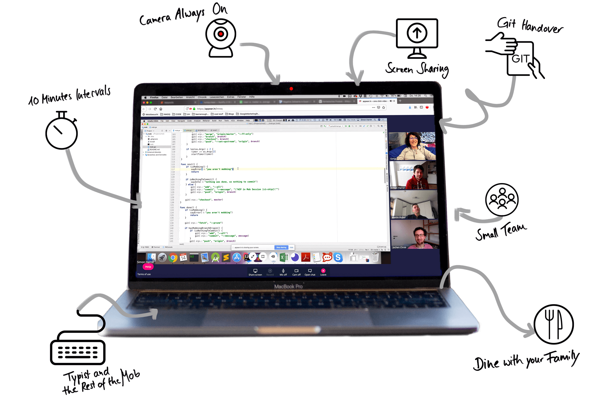

Remote Mob Programming combines two ways of working: Mob Programming and working as a distributed team.
Woody Zuill describes [Mob Programming](http://mobprogramming.org/) as creating the "same thing, at the same time, in the same space, and on the same computer". 
Working in the same space clashes with working as a distributed team at first glance, but actually, it goes together really well. 
With Remote Mob Programming, we collaborate closely in the same virtual space. 
But Remote Mob Programming is more than that.

> We even came to realize that Remote Mob Programming is superior to anything we ever tried before.
>
> &mdash; <cite>[Simon Harrer](https://twitter.com/simonharrer), [Jochen Christ](https://twitter.com/jochen_christ), and [Martin Huber](https://twitter.com/Waterback)</cite>

Below, we summarize the essentials of successful Remote Mob Programming as we understand them. 

## Here's how we do Remote Mob Programming.

1. [Remote Everybody](#remote-everybody)
1. [Camera Always On](#camera-always-on)
1. [Regular On-Site Meetings](#regular-on-site-meetings)
1. [Small Team](#small-team)
1. [Same Time](#same-time)
1. [Typist and the Rest of the Mob](#typist-and-the-rest-of-the-mob)
1. [Screen Sharing](#screen-sharing)
1. [10 Minute Intervals](#10-minute-intervals)
1. [Git Handover](#git-handover)
1. [Group Decisions](#group-decisions)
1. [Constant Momentum](#constant-momentum)
1. [Learn from the Team](#learn-from-the-team)
1. [Trust](#trust)
1. [Save the Planet](#save-the-planet)
1. [Dine with your Family](#dine-with-your-family)

### {:height="36px" width="36px"}&nbsp;&nbsp;Remote Everybody 

For Remote Mob Programming, it is essential that everybody works remotely by default.
It does not work if part of the team works on-site. This will lead to [information asymmetry](https://en.wikipedia.org/wiki/Information_asymmetry).

_We all work from home, but don't feel alone._

We enjoy working from home: a quiet environment, perfect working setup, no commuting, and more quality time with our families and friends.
In previous projects, we sometimes felt isolated from our colleagues.
This radically changed with Remote Mob Programming.
It is real team work.

### {:height="36px" width="36px"}&nbsp;&nbsp;Camera Always On

Working face-to-face is powerful because we communicate with the whole body, not just our words.
And we are much more attentive because any distraction like looking at the smartphone during a discussion will be detected immediately.

_We activate our cameras all the time._

It felt strange at first, but after a few days, it felt natural.
It gives a sense of presence in the team, almost like working in the same room together.
It's easy to see if someone is away from keyboard, talking to their children, or otherwise distracted.

In a multi-monitor setup, we make sure that the camera is at our main screen so that you're looking at each other. 
We mute when we go away from keyboard, but leave the camera on.

### {:height="36px" width="36px"}&nbsp;&nbsp;Regular On-Site Meetings

The better everybody knows each other, the better everybody can collaborate remotely.
Getting to know each other works best on-site.

_We meet on-site once a month._

In the last few months, we met in awesome cities with good transport links, had barbecue at someone's home, or [came together at one of the INNOQ events](https://www.innoq.com/blog/st/2012/09/innoq-company-events/).
Have fun together in real life.

### {:height="36px" width="36px"}&nbsp;&nbsp;Small Team

This is essential.
The whole team works and focuses on the same thing.

With Remote Mob Programming, only one person can talk at the same time.
With larger teams, the individual speaking time shrinks, making it harder to stay focused.
It is easy to become mentally absent.
Also, expect technical issues, such as connectivity problems or interfering noise, to happen more frequently in a larger team. Those issues will block the whole team.

_We have a team of four._

Obviously, the minimum size to form a mob is three.
In our experience, teams with three to four developers provide the best benefit-cost ratio.
A team of four has the great benefit of still being able to form a mob, even if one person is absent.

### {:height="36px" width="36px"}&nbsp;&nbsp;Same Time

One of the prerequisites of Mob Programming is working at the same time.

_We mob at least six hours a day._

To reach these six hours, we align our core working hours. 
We also agree on the same lunch hour.
Still, it's totally OK to have an external meeting, get your hair cut, or spend time with the family.

### {:height="36px" width="36px"}&nbsp;&nbsp;Typist and the Rest of the Mob

We adopted the terminology from [Code with the Wisdom of the Crowd by Mark Pearl](https://pragprog.com/book/mpmob/code-with-the-wisdom-of-the-crowd):

One person controls the keyboard, this is the _typist_.
The _rest of the mob_ discusses the problem, agrees on the solution, and instructs the typist.
The typist follows their instructions, puts them into code, and may ask clarifying questions to understand the solution.
The rest of the mob guides the typist as needed.

_We value the typist as they allow the rest of the mob to focus on solving the problem._

The typist must not code on their own.
This balances the participation of all team members and it reduces the dominance of strong characters.

### {:height="36px" width="36px"}&nbsp;&nbsp;Screen Sharing

We feel most comfortable working in our own individual environment.
It is where we are most productive. 

The typist shares their primary screen, showing the IDE.
It is a good practice to show the IDE fullscreen and disable notifications.

_We all look at the same shared screen._

Looking at and working on the same issue forces us to focus.
It is highly efficient to work with actual code in contrast to having abstract meta discussions. 

We tried collaboration IDEs.
Surprisingly, this lead to worse collaboration.
Impatient members of the rest of the mob circumvented both, the discussion and the typist, by just hacking their ideas.    
While the typist shares the screen, the rest of the mob has no shortcuts.
Only the typist types, the rest of the mob must explain what to do through language.

We accept the time to switch the shared screen at the start of the next mob interval.

### {:height="36px" width="36px"}&nbsp;&nbsp;10 Minute Intervals

Every mob session has a specific goal (e.g. to implement a feature or fix a bug) and may last several hours.
In a mob session, the typist role rotates periodically.
Short rotation periods keep everyone concentrated and every opinion in the mix.

_We rotate every ten minutes._

We tried different rotation periods and considered ten minutes as a good trade-off.
Shorter periods didn't work out for us because of the inherent switching costs in a remote team.

Surprisingly, taking your turn as a typist allows you a mental relaxation.
You just wait for instructions.

### {:height="36px" width="36px"}&nbsp;&nbsp;Git Handover

With on-site Mob Programming, you just pass on the keyboard to hand over to the next person.
This is a challenge for a distributed team.

_We hand over with WIP commits on a temporary git branch._

To have a clean master branch, we work on a temporary _mob-session_ branch.
After each interval, we push a work in progress (WIP) commit to this branch.   
In this branch, we don't care about the commit message, if the code compiles, or if the tests are green.

A quick handover is essential.
At the end of the mob session, we [squash](https://git-scm.com/book/en/v2/Git-Tools-Rewriting-History) the WIP commits into expressive commits and merge into master.

We created a small tool [mob](https://github.com/remotemobprogramming/mob) to simplify this process.

### {:height="36px" width="36px"}&nbsp;&nbsp;Group Decisions

In software engineering, you constantly compare different alternatives and decide for one.
Reversing decisions is often expensive.
[Group decisions are superior over individual decisions](https://en.wikipedia.org/wiki/Group_decision-making).
In Remote Mob Programming, all decisions are group decisions.

_We are happy with our decisions._

With our wealth of know-how, experience, and opinions to discuss, we are able to make well-founded decisions everyone agrees with.
When we are coding, we all agree on changes and code style. 
As a consequence, we don't need code reviews or pull requests.
  
We document decisions with extensive consequences using [Architecture Decision Records](http://thinkrelevance.com/blog/2011/11/15/documenting-architecture-decisions).

### {:height="36px" width="36px"}&nbsp;&nbsp;Constant Momentum

In a feature branch-based workflow, you are blocked waiting for the code review of your pull request.
While waiting, you start another feature and need to switch context.
In a mob session, we have continuous and implicit code reviews -- no feature branches, no waiting, no context switches.

Working alone, you often end up looking up things on Google, in a documentation, or need to figure out how to proceed.
The main purpose of the rest of the mob is to make sure there is constant momentum.
They discuss the problem and think ahead towards the solution, getting rid of any obstacles.

_We get into a rewarding flow everyday._

As we aren't blocked by ourselves, we make good progress.
It feels great.

### {:height="36px" width="36px"}&nbsp;&nbsp;Learn from the Team

Sharing knowledge is at the heart of Mob Programming.

Everything the mob does is the result of in-depth discussions.
Nothing is done without agreeing on the why.
That's where everybody learns.

_We get better every day by learning from each other_

Because the whole teams works on everything together, we're always on the same level of knowledge and have a [bus factor](https://en.wikipedia.org/wiki/Bus_factor) of the size of the team.
We benefit from our different backgrounds and perspectives.
This ranges from learning how to write a good unit test, to debugging effectively, or learning how to prepare a successful meeting.
And we also learn a lot of keyboard shortcuts all the time. 

With Mob Programming, onboarding only takes weeks, not years.

### {:height="36px" width="36px"}&nbsp;&nbsp;Trust

We all work remotely.
The client does not _see_ us working.
So, management has a natural fear of losing control over the team.

Also, there is inherent doubt of a team's productivity, with all team members working on the same issue at the same time.

In a remote context, trust in the self-organization of a team is elementary.

_We build trust by actively communicating._

While management showed us some trust in advance, eventually we earned it through continuous and sincere communication and always delivering what we committed to.

We write daily [check-ins](https://basecamp.com/features/checkins) in our team's chat channel.
A check-in is a short recap of stuff that happened or hasn't worked out as planned.
It could be some personal stuff, too.
Management also reads this channel and thereby is informed.
Obviously, we have no need for a [Daily Scrum](https://www.scrum.org/resources/what-is-a-daily-scrum).

We always take care to hold to our commitments and deliver high quality code in time.
That builds solid trust in the long term.

### {:height="36px" width="36px"}&nbsp;&nbsp;Save the Planet

Daily commuting causes traffic jams, crowded trains, and significant greenhouse gas emissions. 
Even worse, many consultants fly to their customers' offices.

_We don't travel, so zero greenhouse gas emissions._

No travel means no travel costs for us and our customers. 
And at home, we always drink our fair-traded flat white from our Star Wars mugs.  

### {:height="36px" width="36px"}&nbsp;&nbsp;Dine with your Family

As software engineers, we often struggle to balance challenging and rewarding work with time for family and leisure.
Sometimes, it feels mutually exclusive.
From our experience, working on challenging and rewarding projects as a part of an outstanding team requires lots of travelling, staying in hotels overnight, and sometimes even relocation.

_We enjoy more quality time with our families._

We all have young kids.
They are the most important thing in our lives.  
With Remote Mob Programming we get both, rewarding work and quality time with our families and kids.

## Resources

Methods we use

- [Daily check-ins](#trust) to actively communicate our experiences to other teams and managers.
- [Architecture Decision Records](#group-decisions) to document the why of important decisions. 
- [Hill Charts](https://basecamp.com/features/hill-charts) to visualize uncertainty and progress.

Software we use

- [appear.in](https://appear.in) for screensharing
- [mob](https://github.com/remotemobprogramming/mob) for quick git handover (developed by us) 
- [timer (OS X only)](https://github.com/michaelvillar/timer-app) for tracking mob intervals

Hardware we use

- [Blue Yeti Microphone](https://www.bluedesigns.com/products/yeti/) for great audio
- [Logitech C920 HD Pro Webcam](https://www.logitech.com/de-de/product/hd-pro-webcam-c920) for 1080p video

Books

- [Code with the Wisdom of the Crowd by Mark Pearl](https://pragprog.com/book/mpmob/code-with-the-wisdom-of-the-crowd)
- [Mob Programming by Woody Zuill and Kevin Meadows](https://leanpub.com/mobprogramming)
- [Mob Programming Guidebook by Maaret Pyhäjärvi](https://leanpub.com/mobprogrammingguidebook)
- [Debugging Teams by Brian Fitzpatrick and Ben Collins-Sussman](http://shop.oreilly.com/product/0636920042372.do)

Videos and Podcasts

- [Mob Programming: A Whole Team Approach by Woody Zuill](https://www.youtube.com/watch?v=SHOVVnRB4h0)
- [Leaping back into the code via Remote Mobbing by Sal Freudenberg](https://www.pscp.tv/w/1kvKpEEklQQGE?t=24s)
- [Episode 'Mob' in Agile in 3 Minutes by Amitai Schleier](https://agilein3minut.es/32/)

## Authors

Content by [Simon Harrer](https://twitter.com/simonharrer), [Jochen Christ](https://twitter.com/jochen_christ), and [Martin Huber](https://twitter.com/Waterback).
Design by [Sonja Scheungrab](https://twitter.com/multebaerr).
 
Supported by [INNOQ](https://www.innoq.com/en/).
[Imprint](https://www.innoq.com/en/impressum/) [Privacy](https://www.innoq.com/en/datenschutz-20180524/)
